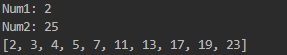

# 🔢 Primos em um Intervalo

Este projeto em **Java** tem como objetivo identificar e exibir todos os **números primos** dentro de um intervalo definido pelo usuário.

## 🧠 Descrição do Algoritmo

O programa solicita dois números inteiros (`num1` e `num2`) e percorre todos os valores dentro desse intervalo, verificando quais deles são **números primos** — ou seja, números que possuem apenas dois divisores: 1 e eles mesmos.

Cada número que atende a essa condição é adicionado a uma lista e exibido ao final da execução.

## ⚙️ Lógica Simplificada

1. O usuário insere o número inicial e o número final do intervalo.
2. Para cada número dentro desse intervalo:
   - O algoritmo testa se ele é divisível por algum número além de 1 e dele mesmo.
   - Caso não seja divisível, ele é considerado **primo**.
3. Todos os números primos encontrados são mostrados em uma lista.

## ⚙️ Lógica Matemática

- n -> numero recebido
- d -> todos os numeros de 2 até n-1

```
n % d == 0 -> não é primo
```

## 💻 Exemplo de Execução


